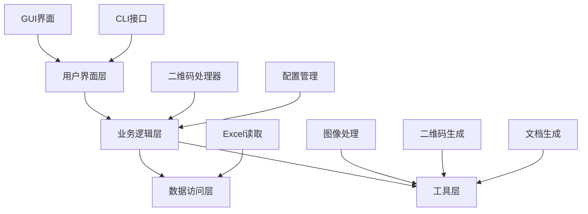
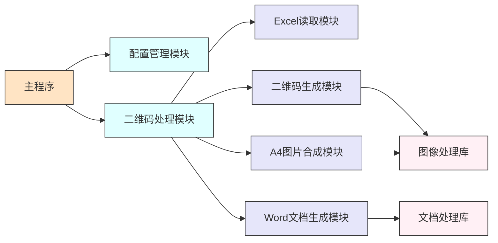
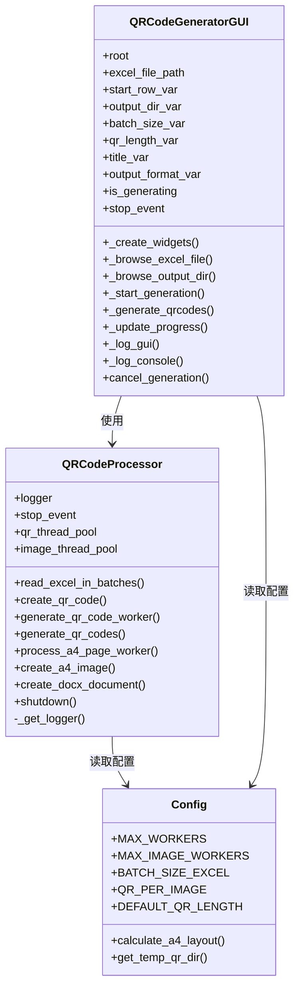
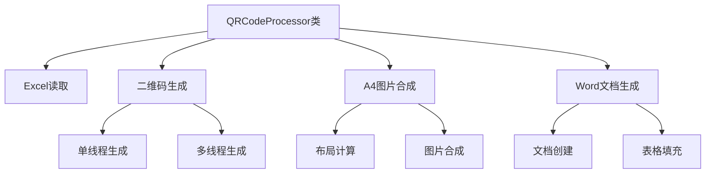
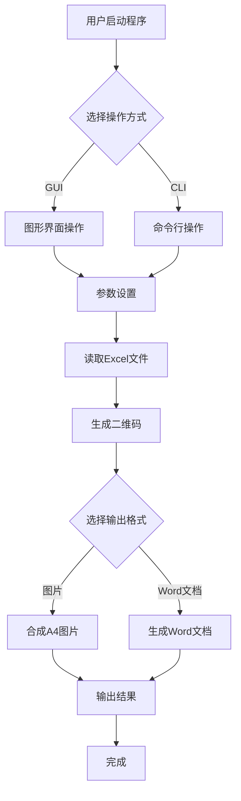
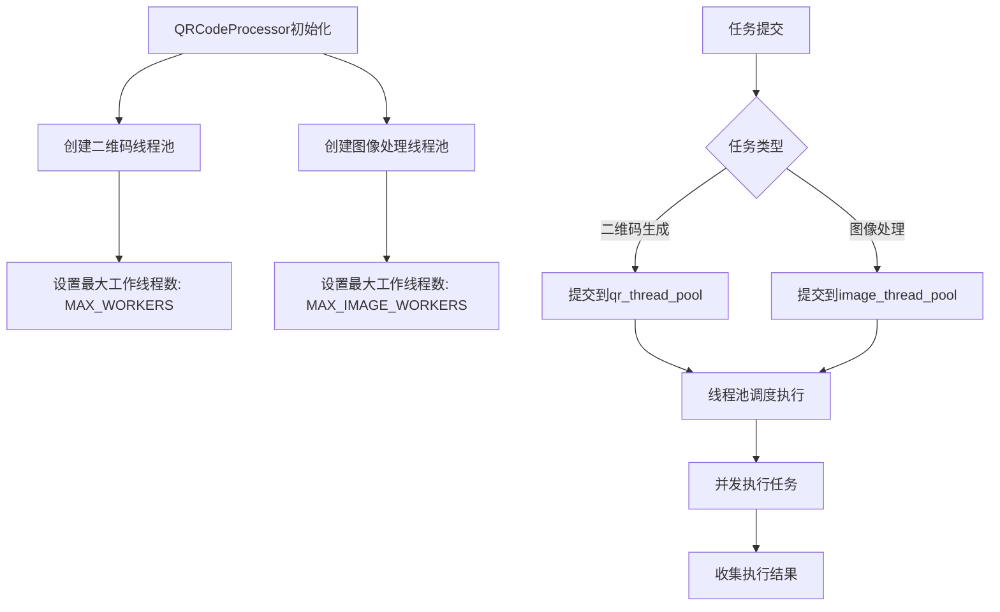
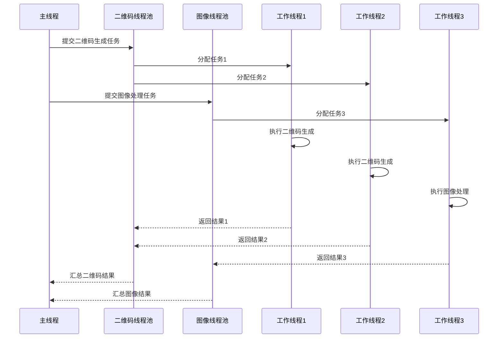

# QRCodeGenerator 系统设计说明书

## 1. 引言

### 1.1 项目概述
QRCodeGenerator 是一个高效的批量二维码生成工具，支持从 Excel 文件读取数据，批量生成二维码并自动排版成 A4 图片。该工具根据用户指定的二维码边长自动计算最佳的 A4 页面行列布局。

### 1.2 编写目的
本文档旨在详细描述 QRCodeGenerator 系统的架构设计、模块关系和工作流程，为系统的维护、扩展和二次开发提供技术参考。

### 1.3 读者对象
- 系统架构师
- 软件开发工程师
- 测试工程师
- 项目经理

## 2. 系统架构设计

### 2.1 整体架构
QRCodeGenerator 采用分层架构设计，主要包括以下几个层次：



### 2.2 技术架构
系统采用 Python 语言开发，主要技术栈包括：
- pandas: 用于 Excel 文件读取
- openpyxl: 用于 Excel 文件解析
- qrcode: 用于二维码生成
- Pillow: 用于图像处理
- tkinter: 用于 GUI 界面开发
- python-docx: 用于 Word 文档生成

## 3. 模块调用关系

### 3.1 模块依赖关系图


### 3.2 核心类图


## 4. 模块设计

### 4.1 核心模块

#### 4.1.1 配置管理模块 (config.py)
该模块负责管理系统的所有配置参数，包括：
- 系统设置（线程数、批处理大小等）
- 图像处理设置（DPI、质量等）
- GUI 设置（窗口大小、默认值等）
- 日志设置
- 错误和消息模板

#### 4.1.2 二维码处理模块 (qrcode_processor.py)
这是系统的核心处理模块，主要功能包括：
- 分批读取 Excel 文件
- 生成二维码图片
- 合成 A4 页面图片
- 生成 Word 文档



### 4.2 用户界面模块

#### 4.2.1 图形界面模块 (qrcode_gui.py)
提供图形用户界面，用户可以通过可视化界面操作：
- 选择 Excel 文件
- 设置开始行、输出目录、批次大小
- 设置二维码边长
- 选择输出格式（图片或 Word 文档）
- 查看处理进度和日志

#### 4.2.2 命令行接口模块 (qrcode_cli.py)
提供命令行接口，支持通过命令行参数进行批量处理：
- 指定 Excel 文件路径
- 设置开始行
- 设置输出目录和批次大小

### 4.3 工具模块

#### 4.3.1 测试数据生成工具 (generate_large_test_data.py)
用于生成大量测试数据，便于性能测试和功能验证。

## 5. 工作流程

### 5.1 整体工作流程


### 5.2 详细处理流程

#### 5.2.1 Excel 文件读取流程
1. 用户指定 Excel 文件路径和开始行
2. 系统按批次读取数据（避免内存溢出）
3. 解析每行数据，提取第一列内容
4. 返回字符串列表供后续处理

#### 5.2.2 二维码生成流程
1. 将字符串列表按组分割（每组包含多个字符串）
2. 为每组数据生成一个二维码图片
3. 使用多线程并行处理提高效率
4. 保存二维码图片到临时目录

#### 5.2.3 A4 图片合成流程
1. 根据二维码边长计算 A4 页面最佳行列布局
2. 将二维码图片按布局排列到 A4 页面上
3. 添加标题和页码信息
4. 保存为高分辨率 PNG 图片

#### 5.2.4 Word 文档生成流程
1. 创建新的 Word 文档
2. 设置页面边距
3. 添加标题
4. 按页面分组二维码
5. 创建表格并填充二维码图片
6. 保存 Word 文档

## 6. 性能优化

### 6.1 多线程处理
系统采用多线程技术处理耗时操作：
- 二维码生成使用线程池并行处理
- A4 图片合成使用独立线程池处理
- 根据 CPU 核心数自动调整线程数量

### 6.2 多线程处理机制详解

#### 6.2.1 线程池架构


#### 6.2.2 任务分发与执行流程


#### 6.2.3 并发处理优势
1. **CPU利用率提升**：通过多线程并行处理，充分利用多核CPU性能
2. **I/O阻塞缓解**：图像处理等I/O密集型操作不会阻塞主线程
3. **响应性增强**：GUI界面在处理过程中保持响应，用户可随时取消操作
4. **资源复用**：使用可重用线程池，避免频繁创建销毁线程的开销

### 6.3 分批处理
为了避免内存溢出，系统采用分批处理策略：
- Excel 文件按批次读取
- 二维码按批次生成
- 控制每批次处理的数据量

### 6.4 资源管理
- 使用可重用的线程池，避免重复创建和销毁线程
- 及时释放图像处理资源
- 提供资源清理接口

## 7. 错误处理

### 7.1 异常捕获
系统在关键节点捕获异常并提供友好的错误提示：
- 文件读取异常
- 二维码生成异常
- 图像处理异常
- 文档生成异常

### 7.2 用户提示
通过消息框和日志提供详细的错误信息，帮助用户定位问题。

## 8. 部署与运行

### 8.1 环境要求
- Python 3.8+
- 依赖库：pandas, openpyxl, qrcode, Pillow, tqdm, python-docx

### 8.2 安装部署
1. 安装依赖：`pip install -r requirements.txt`
2. 运行 GUI：`python src/gui/qrcode_gui.py`
3. 运行 CLI：`python src/qrcode_cli.py [参数]`

### 8.3 打包发布
使用 PyInstaller 打包成可执行文件：
```bash
pyinstaller QRCodeGenerator.spec
```

## 9. 扩展性设计

### 9.1 插件化设计
核心处理模块采用类封装设计，便于扩展新的处理功能。

### 9.2 配置化管理
通过配置文件管理参数，便于调整系统行为而无需修改代码。

### 9.3 接口标准化
各模块间通过标准接口交互，降低模块间耦合度。